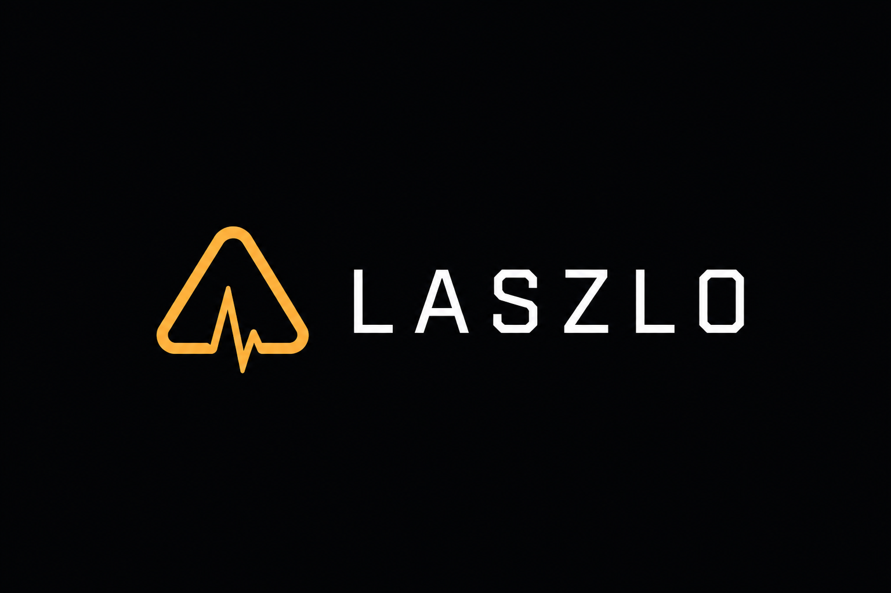

# LASZLO Public Documentation

**Architecture · Brand · Whitepaper index**

---

Public-facing documentation for **LASZLO Quantification**. Core engineering repositories remain private during active development.

## Start here

| Document | Description |
|----------|-------------|
| [Public projects](projects/README.md) | Omni-Asset Terminal · KeyVeil · FranklinNexus works |
| [Architecture overview](architecture/overview.md) | Closed-loop system design — ingest, infer, execute |
| [Brand guidelines](brand/README.md) | Logo usage, colors, voice |
| [Whitepaper index](whitepaper/README.md) | Links to LASZLO whitepaper v1/v2 and progress notes |

## Quick links

| Resource | URL |
|----------|-----|
| Organization profile | https://github.com/LASZLO-Quantification |
| Whitepaper v2 (canonical) | https://wisdomechoes.net/blog/laszlo-whitepaper-v2 |
| Engineering progress (2026) | https://wisdomechoes.net/blog/laszlo-status-2026-06 |
| Home | https://wisdomechoes.net |

## Brand assets

Downloadable logos and UI concepts live in [`brand/assets/`](brand/assets/).  
Preferred formats: dark horizontal lockup for README headers; `laszlo-mark-256.png` for avatars.

## Compliance

LASZLO and related tools are for technical research and closed-loop systems engineering only. **Not investment advice.** No return promises. On-chain activity involves risk; past performance is not indicative of future results.

## License

Brand assets © LASZLO Quantification. Documentation is provided for reference; do not imply endorsement without permission.

---

Hong Kong · <a href="https://wisdomechoes.net">wisdomechoes.net</a>

