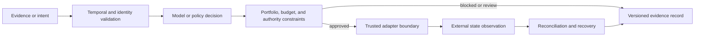

# Architecture Overview

Szigor Research documents decision systems where evidence, intent, constraints,
execution, and audit state remain separate contracts.

## Shared decision architecture

The model may differ by product, but the authority boundary does not disappear.

## Portfolio map

| System | Input contract | Constraint boundary | Evidence output | External boundary |
|---|---|---|---|---|
| LASZLO | Point-in-time on-chain market events | Portfolio, execution, and operator risk | Replayable signal and execution state | EVM adapter |
| JANOS | Point-in-time US equity, company, and broker data | Portfolio, release, account, and halt controls | Dataset, experiment, release, recovery, and audit evidence | IBKR Paper adapter |
| KeyVeil | Agent payment intent and authorization context | Session, approval, and atomic budget policy | Hashed decision receipt | Executor intentionally excluded |
| Omni Terminal | Market data and deterministic strategy signal | Cash, position, fee, and slippage estimates | Local append-only research ledger | Broker intentionally excluded |

## Shared principles

1. Validate monetary, temporal, and identity fields before decision logic.
2. Fail closed when a required authority, source, or state store is unavailable.
3. Scope stable IDs and idempotency to the owning context.
4. Separate authorization from execution success.
5. Reconcile internal projections against an external authority before recovery.
6. Preserve enough evidence to rebuild and explain state.
7. Keep public examples synthetic and private implementations out of public history.

## Boundaries

LASZLO and JANOS are private research labs, not public SDKs. Public summaries
omit data entitlements, providers, strategies, thresholds, credentials,
signing, routing, account state, incidents, and operator telemetry.

## Further reading

- [Portfolio](../projects/README.md)
- [Open-source policy](../open-source/README.md)
- [KeyVeil architecture](https://github.com/LASZLO-Quantification/KeyVeil/blob/main/docs/ARCHITECTURE.md)
- [Omni architecture](https://github.com/LASZLO-Quantification/Omni-Asset-Quant-Terminal/blob/main/docs/REFERENCE_ARCHITECTURE.md)
