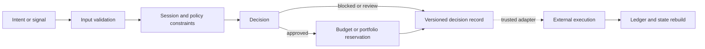

# Architecture Overview

LASZLO Quantification works on automated decision systems where intent,
constraints, approval, execution, and audit state remain separate contracts.

## Shared decision architecture

## Public implementations

| Contract | KeyVeil | Omni Terminal |
|---|---|---|
| Input | Agent payment intent | Strategy signal and market data |
| Constraints | Session, allowlists, approvals, budgets | Cash, position, fees, slippage |
| Record | Hashed decision receipt | Local append-only ledger row |
| State | Budget reservation lifecycle | Portfolio state rebuilt from ledger |
| Execution | Excluded | Local research confirmation only |

## Private core

Private LASZLO research extends the same discipline to low-latency on-chain
ingestion, model inference, routing, position management, and operator risk
controls. Public summaries intentionally omit data sources, provider topology,
strategy internals, thresholds, signing, and incident telemetry.

## Design principles

1. Validate monetary and identifier fields before policy evaluation.
2. Fail closed when a required authority or state store is unavailable.
3. Scope stable ids and idempotency to the owning authorization context.
4. Separate authorization from execution success.
5. Preserve enough context to rebuild and explain state.
6. Keep public examples synthetic and private implementations out of public history.

## Further reading

- [Public projects](../projects/README.md)
- [KeyVeil architecture](https://github.com/LASZLO-Quantification/KeyVeil/blob/main/docs/ARCHITECTURE.md)
- [Omni architecture](https://github.com/LASZLO-Quantification/Omni-Asset-Quant-Terminal/blob/main/docs/REFERENCE_ARCHITECTURE.md)
