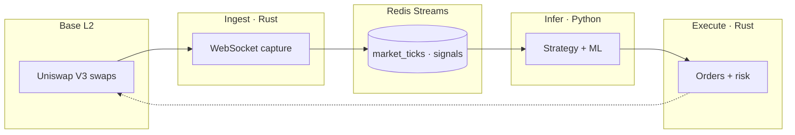

# Architecture Overview

> Public summary. Canonical technical whitepaper: [LASZLO Whitepaper v2](https://wisdomechoes.net/blog/laszlo-whitepaper-v2)

## System definition

**LASZLO** is a closed-loop on-chain alpha terminal for EVM chains — **Base L2** first.

| Layer | Technology | Responsibility |
|-------|------------|----------------|
| **Ingest** | Rust | WebSocket log subscription, Swap decode, stream publish |
| **Infer** | Python | Feature engineering, ML signal generation |
| **Execute** | Rust | Order routing, position management, risk gates |
| **Learn** | Pipeline | Collect → label → retrain → deploy |

## Data flow

## Design principles

1. **Signal over volume** — decision-grade data only  
2. **Heterogeneous stack** — Rust for latency; Python for research velocity  
3. **Risk-first execution** — automated stops, conservative entry, operator kill-switches  
4. **Operator realism** — observable pipelines, explicit contracts, drill-tested failure modes  

## What LASZLO is not

- A block explorer or charting toy  
- A copy-trading or signal-channel product  
- A CEX derivatives stack  

## Stack

| Component | Choice |
|-----------|--------|
| Message bus | Redis Streams |
| Target chain | Base L2 (EVM-extensible) |
| DEX focus | Uniswap V3 spot |
| Orchestration | Docker Compose |

## Status

Active engineering on Base L2. Full ingest → signal → execute loop implemented. Current focus: data quality, model calibration, production hardening.

## Further reading

- [Whitepaper v2](https://wisdomechoes.net/blog/laszlo-whitepaper-v2) — full technical narrative  
- [Progress notes (2026)](https://wisdomechoes.net/blog/laszlo-status-2026-06)  
- [Organization profile](https://github.com/LASZLO-Quantification)
