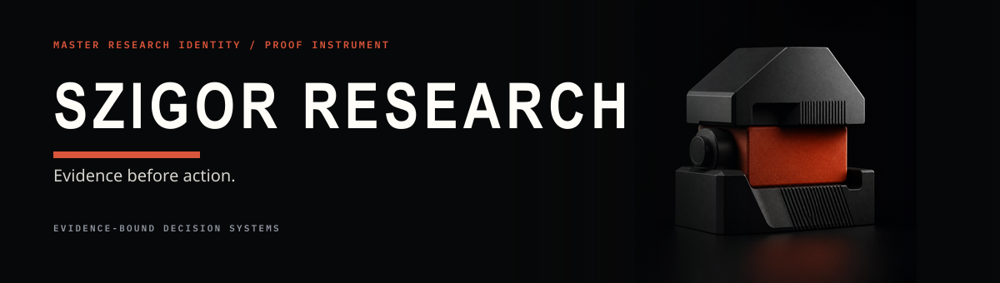
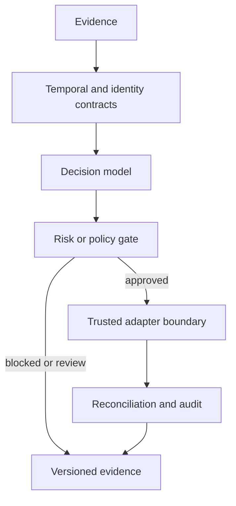

**Evidence-bound decision systems for markets and autonomous software.**

[Portfolio](https://github.com/Szigor-Research/.github/tree/main/docs/projects) |
[Architecture](https://github.com/Szigor-Research/.github/blob/main/docs/architecture/overview.md) |
[Visual system](https://github.com/Szigor-Research/.github/blob/main/docs/brand/WITNESS_CUT.md) |
[Open-source policy](https://github.com/Szigor-Research/.github/blob/main/docs/open-source/README.md) |
[Security](https://github.com/Szigor-Research/.github/blob/main/SECURITY.md) |
[Field notes](https://wisdomechoes.net/project)

Hong Kong | Private research labs and public reference implementations

---

## Research brands

Szigor Research is the master research brand. LASZLO and JANOS are specialist
sub-brands beneath it and peers to each other. Each brand has an independent
primary mark and the same professional level of identity, documentation, and
delivery. The brand structure does not by itself claim a legal holding-company,
equity, account, or IP relationship.

| Brand | Role | Research boundary | Identity instrument | Current mode |
|---|---|---|---|---|
| **Szigor Research** | Master research brand | Public engineering standards, evidence governance, and portfolio | Proof Instrument | Public research identity |
| **LASZLO** | On-chain research sub-brand | Point-in-time ingestion, model research, deterministic risk gates, execution state, and replay | Triangle Pulse | Private systems research |
| **JANOS** | US equity research sub-brand | Dual-price datasets, company evidence, constrained portfolios, broker-state recovery, and signed releases | Ledger Window | Private systems research; IBKR Paper only |

The three identities follow one Witness Cut standard of proof without sharing
one logo. The research systems share engineering discipline, not strategy code
or unsupported performance claims. Real data, credentials, models, routing
details, and operator telemetry remain private.

## Public reference products

| Project | Demonstrates | Maturity |
|---|---|---|
| [**KeyVeil**](https://github.com/Szigor-Research/KeyVeil) | Fail-closed policy, verified approval context, atomic budget reservation, and hashed receipts for AI-agent payment intents | Alpha reference; no signer or funds |
| [**Omni-Asset Quant Terminal**](https://github.com/Szigor-Research/Omni-Asset-Quant-Terminal) | Signals, execution constraints, local ledger replay, portfolio state, and backtesting | Runnable research reference; no broker connection |

Public repositories contain generic contracts and synthetic examples. They
are not reduced copies of the private labs.

## Shared operating model

## Engineering standard

- **Point-in-time first:** event time and availability time are separate.
- **Fail closed:** missing authority, data, or recovery state cannot authorize action.
- **Deterministic boundaries:** AI may propose; policy, risk, and execution remain explicit.
- **Verifiable state:** releases, receipts, ledgers, and recovery evidence are content-bound.
- **Honest maturity:** synthetic tests are not presented as live, licensed, or production proof.
- **Private by default:** credentials, real account data, models, and incident evidence stay private.

## Collaboration

We are open to technical work around point-in-time market research, auditable
automation, agent authorization, edge decision systems, and operator risk
tooling. Start with the [portfolio index](https://github.com/Szigor-Research/.github/tree/main/docs/projects)
or contact us through [wisdomechoes.net](https://wisdomechoes.net/connect).

## Notice

Public repositories are engineering references. They do not provide custody,
brokerage, investment advice, guaranteed returns, or production payment
execution. Review each repository's security model and limitations before use.

---

**Szigor Research** | *Evidence before action.*

