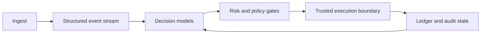

<div align="center">


# LASZLO Quantification

**Risk-first decision infrastructure for constrained, auditable automation.**

[](https://github.com/orgs/LASZLO-Quantification/repositories)
[](https://github.com/LASZLO-Quantification/KeyVeil)
[](https://github.com/LASZLO-Quantification/Omni-Asset-Quant-Terminal)
[](https://github.com/LASZLO-Quantification/.github/tree/main/docs)

<sub>Hong Kong | Open reference implementations backed by private systems research</sub>

</div>

---

## What we build

LASZLO Quantification develops infrastructure for automated decisions that
must remain constrained, explainable, and recoverable.

| Capability | Engineering focus |
|---|---|
| **Quant research systems** | Deterministic signals, execution constraints, ledger replay, portfolio state, and reproducible backtests. |
| **Agent payment policy** | Delegated sessions, verified approvals, atomic budgets, and versioned decision receipts. |
| **Private execution research** | Low-latency ingestion, model-driven inference, routing, position management, and operator risk controls. |

The common operating model separates non-approved and approved outcomes:

```text
input -> validate -> constrain -> decide
                         |-> blocked or review -> record
                         |-> approved -> reserve -> record -> trusted adapter
```

## Public reference products

### KeyVeil

**Policy decisions for AI-agent payment intents.**

[Repository](https://github.com/LASZLO-Quantification/KeyVeil) |
[Architecture](https://github.com/LASZLO-Quantification/KeyVeil/blob/main/docs/ARCHITECTURE.md) |
[Security model](https://github.com/LASZLO-Quantification/KeyVeil/blob/main/docs/SECURITY_MODEL.md)

- Fail-closed session and organization policy boundaries.
- Intent- and authorization-context-bound approval grants.
- Atomic session-daily and budget-scope-weekly reservations.
- Versioned receipts with canonical intent and receipt hashes.
- Synthetic workbench with no signer and no funds.

### Omni-Asset Quant Terminal

**Auditable reference loop for systematic investment research.**

[Repository](https://github.com/LASZLO-Quantification/Omni-Asset-Quant-Terminal) |
[Architecture](https://github.com/LASZLO-Quantification/Omni-Asset-Quant-Terminal/blob/main/docs/REFERENCE_ARCHITECTURE.md) |
[Open-source boundary](https://github.com/LASZLO-Quantification/Omni-Asset-Quant-Terminal/blob/main/docs/OPEN_SOURCE_BOUNDARY.md)

- Value averaging, DCA, and rebalance signals.
- Cash, position, fee, and slippage constraints.
- Local append-only ledger and deterministic state rebuild.
- Cross-asset diagnostics and monthly backtests.
- Research mode only, with no broker connection.

## Private core research

The private LASZLO stack explores a closed ingest, inference, execution, and
feedback loop for EVM markets. Production data, models, routing details,
credentials, signing systems, incident records, and operator telemetry are not
published.



Public repositories contain generic contracts and synthetic examples, not
copies of private execution code.

## Engineering standard

- **Fail closed:** unavailable policy, approval, or budget state cannot silently authorize action.
- **Explicit contracts:** fields, statuses, and state transitions are versioned and tested.
- **Audit before aesthetics:** interfaces expose source, freshness, constraints, and runtime proof.
- **Synthetic by default:** public fixtures contain no customer, wallet, ledger, or incident data.
- **Honest product boundaries:** simulations are labeled; research tools do not claim execution.

## Work with us

We are open to technical collaboration around:

- agent authorization and machine-payment controls;
- auditable quant research workflows;
- execution-risk architecture and operator tooling;
- selective integrations that preserve explicit trust boundaries.

Start with the [public project index](https://github.com/LASZLO-Quantification/.github/tree/main/docs/projects)
or contact us through [wisdomechoes.net](https://wisdomechoes.net).

## Important notice

Public repositories are reference implementations for engineering research.
They do not provide custody, brokerage, investment advice, guaranteed returns,
or production payment execution. Review each repository's security model and
limitations before integration.

---

<div align="center">


**LASZLO Quantification** | *Constrained decisions. Verifiable state.*

</div>
