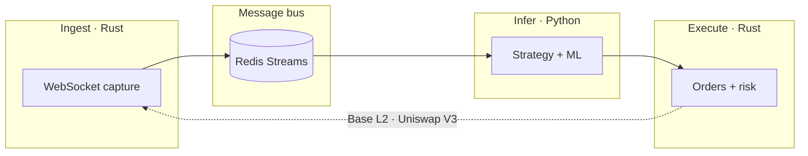

### Institutional on-chain alpha infrastructure

**From on-chain noise to executable alpha** · Base L2

机构级闭环链上 Alpha 终端 — 采集、推理、执行、风控一体化

 

---

## The problem

On-chain markets never sleep. Event volume is enormous; **signal density is not**.

Most products stop at visibility — alerts, dashboards, copy-trading shells. The hard problem remains:

> How do you turn filtered signal into **repeatable, risk-bounded execution** — with an audit trail?

Retail tooling is fragmented. Institutional workflows are slow to adapt to L2. **LASZLO closes that gap.**

---

## What LASZLO is

A **closed-loop alpha terminal** for EVM chains — **Base L2** today, architected to extend.

Not a block explorer. Not a signal channel. Not a copy-trading app. **Infrastructure an operator runs.**

| Layer | Role |
|-------|------|
| **Ingest** | Low-latency on-chain event capture |
| **Infer** | Feature engineering + ML signal generation |
| **Execute** | Unified routing, position management, risk gates |
| **Learn** | Data flywheel — collect → label → retrain → deploy |

**One pipeline. One operator surface. Risk before return.**

---

## Built different

| Typical tooling | LASZLO |
|-----------------|--------|
| Charts and alerts | **Signal → execution loop** |
| Fragmented scripts | **Unified ingest / infer / execute stack** |
| Risk as an afterthought | **Risk gates before every order** |
| Demo-grade infra | **Observable, drill-tested, operator-first** |

---

## Principles

- **Signal over volume** — only decision-grade data enters the loop
- **Heterogeneous by design** — Rust for latency; Python for research velocity
- **Risk-first execution** — automated stops, conservative entry, operator kill-switches
- **Infrastructure, not hype** — built to harden and measure

Named after **Laszlo Hanyecz** — the first real on-chain exchange. The reference is **execution discipline**, not nostalgia.

---

## Stack

| Component | Technology |
|-----------|------------|
| Ingestion & execution | Rust |
| Strategy & ML | Python |
| Message bus | Redis Streams |
| Target chain | Base L2 (EVM-extensible) |
| DEX focus | Uniswap V3 spot |
| Orchestration | Docker Compose |

---

## Operator surface

  
   
  <em>Terminal concept — dark-mode operator UI. Production systems under active development.</em>

---

## Status

**Active engineering on Base L2.** The full ingest → signal → execute loop is implemented. Current focus: data quality, model calibration, and production hardening.

We ship like an infrastructure team — measurable pipelines, explicit risk gates, reproducible research cycles.

---

## Read more

| Resource | Link |
|----------|------|
| **Public docs** | [github.com/LASZLO-Quantification/.github/tree/main/docs](https://github.com/LASZLO-Quantification/.github/tree/main/docs) |
| Whitepaper v2 | [wisdomechoes.net/blog/laszlo-whitepaper-v2](https://wisdomechoes.net/blog/laszlo-whitepaper-v2) |
| Engineering progress | [wisdomechoes.net/blog/laszlo-status-2026-06](https://wisdomechoes.net/blog/laszlo-status-2026-06) |
| Home | [wisdomechoes.net](https://wisdomechoes.net) |

---

## Open engineering

This organization publishes **research, design, and brand artifacts** publicly — see **[docs](https://github.com/LASZLO-Quantification/.github/tree/main/docs)**.

Core repositories remain **private during active development**. **Follow [@LASZLO-Quantification](https://github.com/LASZLO-Quantification)** for selective releases and partner-facing tooling as we open the stack.

**Early access or research collaboration** → [wisdomechoes.net](https://wisdomechoes.net)

---

 

**LASZLO** · *Signal to execution*

 

Hong Kong · <a href="https://wisdomechoes.net">wisdomechoes.net</a>

